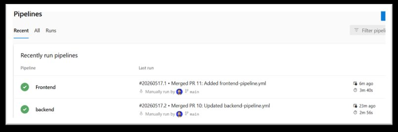
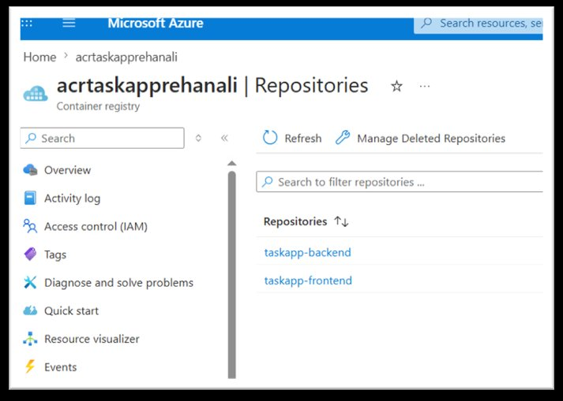

# Fullstack Todo App — CI/CD with Azure DevOps

**Student:** Rehan Ali
**Reg No:** NUM-BSCS-2023-15
**Course:** Cloud Computing — Tkxel Lab
**Instructor:** Mr. Shehzad Arif
**Date:** 14-05-2026

---

## 🔗 Live Application URL

> **Frontend (Azure App Service):**
> [https://app-taskapp-frontend-rehanali.azurewebsites.net](https://app-taskapp-frontend-rehanali.azurewebsites.net)
>
> ⚠️ *Note: Azure Static Web Apps was unavailable in my region, so the frontend was deployed as an Azure App Service (container-based), configured with ACR — functionally equivalent.*

---

## 📸 Successful Pipeline Run



*Both the backend and frontend CI/CD pipelines completed successfully in Azure DevOps — Frontend (3m 40s) and backend (2m 56s) — triggered by merged PRs on the `main` branch.*

---

## 📸 Azure Container Registry (ACR) with Pushed Images



*Both Docker images — `taskapp-backend` and `taskapp-frontend` — were successfully pushed to `acrtaskapprehanali.azurecr.io` and are visible in the Azure Container Registry repositories.*

---

## Project Overview

This project containerizes a fullstack Node.js + React Todo application and deploys it to Azure using a full CI/CD pipeline built on Azure DevOps.

### Tech Stack

| Layer | Technology |
|---|---|
| Frontend | React (served via Nginx in Docker) |
| Backend | Node.js / Express |
| Database | Azure SQL (serverless tier) |
| Container Registry | Azure Container Registry (ACR) |
| Hosting | Azure App Service (container) |
| CI/CD | Azure DevOps Pipelines |
| Version Control | GitHub + Azure Repos (imported) |

---

## Repository Structure

```
fullstack-todo-app/
├── backend/
│   ├── Dockerfile
│   ├── .dockerignore
│   └── ...
├── frontend/
│   ├── Dockerfile
│   ├── nginx.conf
│   ├── .dockerignore
│   └── ...
├── .azure/
│   ├── backend-pipeline.yml
│   └── frontend-pipeline.yml
└── README.md
```

---

## Phase Summary

### Phase 1 — Fork & Understand Application
- Forked from [ashen8981/fullstack-todo-app](https://github.com/ashen8981/fullstack-todo-app)
- Cloned locally and analyzed frontend/backend communication via ports
- Implemented **Git Flow** branching: `main` (production) → `develop` (integration) → `feature/*` branches

### Phase 2 — Dockerize the Application
- Updated `Dockerfile` for both backend and frontend
- Created `nginx.conf` in `frontend/` to serve the React build on port 80
- Added `.dockerignore` files to reduce image size
- Built and tested the full stack locally at `http://localhost:8080` using Docker containers (backend, frontend, MySQL)

### Phase 3 — Provision Azure Resources
- Created a **Resource Group** following lab naming conventions
- Created an **Azure Container Registry (ACR)** with admin user enabled
- Created an **Azure SQL Server & Database** (serverless tier, auto-pause enabled)
- Initialized the database schema
- Deployed **backend** to Azure App Service with environment variables (DB credentials, port)
- Deployed **frontend** as a container App Service (Static Web Apps unavailable in region)

### Phase 4 — Set Up Azure DevOps
- Created Azure DevOps organization and private project `taskapp-cicd`
- Imported GitHub repository into Azure Repos
- Applied **branch policies** on `main`: minimum 1 reviewer + work item link required
- Created two **Service Connections**: Azure Resource Manager + Docker Registry (ACR)

### Phase 5 — CI/CD Pipelines
- Created variable group `taskapp-variables` with pipeline secrets (DB connection string stored as secret variable, never in code)
- **Backend pipeline** (`backend-pipeline.yml`): triggered on `backend/` changes, builds & pushes Docker image to ACR, deploys to App Service
- **Frontend pipeline** (`frontend-pipeline.yml`): same pattern for frontend image
- Both pipelines use **multi-stage** build → deploy with **approval gates** for production
- Assigned `AcrPush` role to the Azure DevOps service principal

### Phase 6 — Verification
- ✅ Forked GitHub repo: [rehanali1092/fullstack-todo-app](https://github.com/rehanali1092/fullstack-todo-app)
- ✅ Git Flow branches in place (`main`, `develop`, `feature/*`)
- ✅ Docker images pushed to ACR (`taskapp-backend`, `taskapp-frontend`)
- ✅ Azure SQL Database running with schema initialized
- ✅ Frontend accessible via App Service URL
- ✅ End-to-end test passed (tasks added via frontend appear in Azure SQL)
- ✅ Both pipelines ran successfully
- ✅ Multi-stage pipelines with approval gates
- ✅ No secrets in code (`.env` excluded via `.gitignore`)


